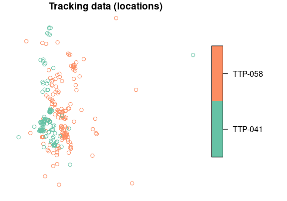
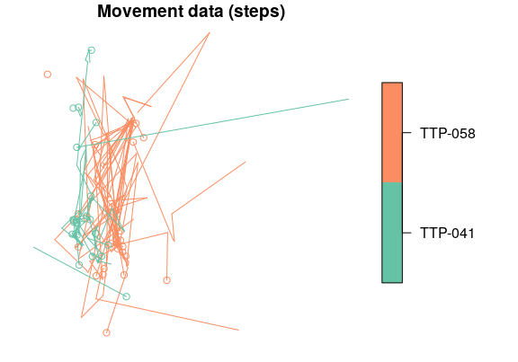

<!-- README.md is generated from README.Rmd. Please edit that file -->

# sftrack: Modern classes for tracking and movement data 

<!-- badges: start -->

[](https://www.repostatus.org/#active)
[](https://opensource.org/license/mit/)
[](https://CRAN.R-project.org/package=sftrack)
[](https://CRAN.R-project.org/package=sftrack)
<!-- [](https://travis-ci.org/mablab/sftrack)  -->
<!-- [](https://travis-ci.org/mablab/sftrack)  -->
[](https://github.com/mablab/sftrack/actions)
<!-- badges: end -->

`sftrack` provides modern classes for **tracking and movement data**,
relying on `sf` spatial infrastructure. Tracking data are made of
tracks, i.e. series of locations with at least 2-dimensional spatial
coordinates (x,y), a time index (t), and individual identification (id)
of the object being monitored; movement data are made of trajectories,
i.e. the line representation of the path, composed by steps (the
straight-line segments connecting successive locations). `sftrack` is
designed to handle movement of both living organisms and inanimate
objects.


The development and design of the `sftrack` package follow three simple
principles:

1.  **Minimal and focused:** this is basically the Unix philosophy. Do a
    simple thing, and do it well. The scope of the package is limited
    (see above), with as few dependencies as possible;
2.  **User-friendly:** `sftrack` is designed to be as easy to use as
    familiar R structures like `data.frame`s and `sf` objects. `sftrack`
    objects are tidy, and follow the idea that rows are records
    (locations) and columns are variable (following the semantics of
    tracking and movement data);
3.  **Flexible and extensible:** `sftrack` is meant first for users to
    use on their data, but also directly designed to address other
    developers’ needs for their own tracking packages.

## Getting started

To get started, install `sftrack` directly from CRAN, or check the
development version on GitHub with the
[remotes](https://cran.r-project.org/package=remotes) package:

``` r
# To install the stable version from CRAN
install.packages("sftrack")

# To install the dev version with built vignettes
remotes::install_github("mablab/sftrack", ref = "dev", build_vignettes = TRUE)
```

The `dev` version is updated much more frequently and should pass the
majority of CRAN checks. However, if you install the `dev` version,
understand it may still contain some bugs. Please submit any bug you
find to the [issues](https://github.com/mablab/sftrack/issues) page.

## A minimal introduction to `sftrack` and `sftraj` objects

The easiest way to create an `sftrack` object is to start from a
`data.frame` with all information as columns, typically the raw data
extracted from telemetry devices:

``` r
library("sftrack")
data(raccoon)
raccoon$timestamp <- as.POSIXct(as.POSIXlt(raccoon$timestamp, tz = "EST5EDT"))
head(raccoon)
#>   animal_id latitude longitude           timestamp height hdop vdop fix
#> 1   TTP-058       NA        NA 2019-01-18 19:02:30     NA  0.0  0.0  NO
#> 2   TTP-058 26.06945 -80.27906 2019-01-18 20:02:30      7  6.2  3.2  2D
#> 3   TTP-058       NA        NA 2019-01-18 21:02:30     NA  0.0  0.0  NO
#> 4   TTP-058       NA        NA 2019-01-18 22:02:30     NA  0.0  0.0  NO
#> 5   TTP-058 26.06769 -80.27431 2019-01-18 23:02:30    858  5.1  3.2  2D
#> 6   TTP-058 26.06867 -80.27930 2019-01-19 00:02:30    350  1.9  3.2  3D
```

In order to convert your raw data into an `sftrack` object, use the
function `as_sftrack()`. The function requires the three main elements
of tracking data:

  - coordinates of the locations in at least the `x` and `y` axes (can
    be UTM, lat/long, etc., with projection provided in `crs`);
  - timestamps of the locations as `POSIXct` (*or* as `integer`);
  - grouping information (referred to as a “groups”), providing at least
    the identity of each individual.

<!-- end list -->

``` r
my_sftrack <- as_sftrack(
  data = raccoon,
  coords = c("longitude","latitude"),
  time = "timestamp",
  group = "animal_id",
  crs = 4326)
head(my_sftrack)
#> Sftrack with 6 features and 10 fields (3 empty geometries) 
#> Geometry : "geometry" (XY, crs: WGS 84) 
#> Timestamp : "timestamp" (POSIXct in EST5EDT) 
#> Groupings : "sft_group" (*id*) 
#> -------------------------------
#>   animal_id latitude longitude           timestamp height hdop vdop fix
#> 1   TTP-058       NA        NA 2019-01-18 19:02:30     NA  0.0  0.0  NO
#> 2   TTP-058 26.06945 -80.27906 2019-01-18 20:02:30      7  6.2  3.2  2D
#> 3   TTP-058       NA        NA 2019-01-18 21:02:30     NA  0.0  0.0  NO
#> 4   TTP-058       NA        NA 2019-01-18 22:02:30     NA  0.0  0.0  NO
#> 5   TTP-058 26.06769 -80.27431 2019-01-18 23:02:30    858  5.1  3.2  2D
#> 6   TTP-058 26.06867 -80.27930 2019-01-19 00:02:30    350  1.9  3.2  3D
#>       sft_group                   geometry
#> 1 (id: TTP-058)                POINT EMPTY
#> 2 (id: TTP-058) POINT (-80.27906 26.06945)
#> 3 (id: TTP-058)                POINT EMPTY
#> 4 (id: TTP-058)                POINT EMPTY
#> 5 (id: TTP-058) POINT (-80.27431 26.06769)
#> 6 (id: TTP-058)  POINT (-80.2793 26.06867)
```

``` r
summary_sftrack(my_sftrack)
#>     group points NAs          begin_time            end_time length_m
#> 1 TTP-041    223   0 2019-01-18 19:02:30 2019-02-01 18:02:07 10212.55
#> 2 TTP-058    222   0 2019-01-18 19:02:30 2019-02-01 18:02:30 26893.27
```

While `sftrack` objects contain tracking data (locations), they can
easily be converted to movement data (with a step model instead) with
`as_sftraj`:

``` r
my_sftraj <- as_sftraj(my_sftrack)
head(my_sftraj)
#> Sftraj with 6 features and 10 fields (3 empty geometries) 
#> Geometry : "geometry" (XY, crs: WGS 84) 
#> Timestamp : "timestamp" (POSIXct in EST5EDT) 
#> Grouping : "sft_group" (*id*) 
#> -------------------------------
#>   animal_id latitude longitude           timestamp height hdop vdop fix
#> 1   TTP-058       NA        NA 2019-01-18 19:02:30     NA  0.0  0.0  NO
#> 2   TTP-058 26.06945 -80.27906 2019-01-18 20:02:30      7  6.2  3.2  2D
#> 3   TTP-058       NA        NA 2019-01-18 21:02:30     NA  0.0  0.0  NO
#> 4   TTP-058       NA        NA 2019-01-18 22:02:30     NA  0.0  0.0  NO
#> 5   TTP-058 26.06769 -80.27431 2019-01-18 23:02:30    858  5.1  3.2  2D
#> 6   TTP-058 26.06867 -80.27930 2019-01-19 00:02:30    350  1.9  3.2  3D
#>       sft_group                       geometry
#> 1 (id: TTP-058)                    POINT EMPTY
#> 2 (id: TTP-058)     POINT (-80.27906 26.06945)
#> 3 (id: TTP-058)                    POINT EMPTY
#> 4 (id: TTP-058)                    POINT EMPTY
#> 5 (id: TTP-058) LINESTRING (-80.27431 26.06...
#> 6 (id: TTP-058) LINESTRING (-80.2793 26.068...
```

Both objects can easily be plotted with base R plot functions, which
highlights the fundamental difference between tracking and movement data
(`sftrack` on the left; `sftraj` on the right):

``` r
plot(my_sftrack, main = "Tracking data (locations)")
plot(my_sftraj, main = "Movement data (steps)")
```



## Roadmap

  - Data class converters from the main tracking packages, such as
    `move::Move` and `trackeR::trackeRdata`, integrated into
    `as_sftrack`;
  - More plotting options for tracks and trajectories (in base R and
    `ggplot2`);
  - Provide Gantt chart-like or chronogram-like graphs;
  - Dynamic exploration of trajectories.

## How can you help?

1.  **Submit any bug you find to the
    [issues](https://github.com/mablab/sftrack/issues) page;**
2.  Address open questions (see below);
3.  Contribute use cases (see below).

### Address open questions: *We need your feedback\!*

While the foundations of the package are now pretty solid, we are still
dealing with open questions about several aspects of the package,
including the names of `sftrack` variables (e.g. coordinates,
timestamps, id and error), the structure of the grouping factor, or the
structure of the error term.

If you have strong opinions or simply want to help on the technical
side, we invite you to comment on those [open issues
here](https://github.com/mablab/sftrack/labels/question).

### Contribute use cases: *We need your feedback\!*

We also need to precisely understand what is expected from such a
package. The idea here is to collect all possible use cases for a
trajectory object in R. We know they are multiple, and will contribute
our own use cases — however, we want `sftrack` to be as useful as
possible, and to act as a center piece for movement in R, so we need you
to tell us how you would use it. **In other words, we want to understand
what you expect from such a package, as a user or as a developer.** For
this, we ask you to fill out special issues in the GitHub tracker of the
package, following the [‘Use case’
template](https://github.com/mablab/sftrack/issues/new?assignees=&labels=&template=use-case.md&title=%5BUse+case%5D+Change+this+title).

Use cases do not need to be very complicated, but need to present a
specific use in human terms, the technical requirements associated to
it, and the input and output of the use case. Such use case could look
like this:

> **\[Use case\] Amazing plot for trajectory**
> 
> **Use case:**
> 
> Plot a trajectory using my `special_trajplot` function, which shows
> \[something amazing\].
> 
> **Requirements:**
> 
>   - spatial coordinates (x,y) as geographic coordinates with
>     projection information
> 
>   - a time (t) as POSIXt object, ordered in time
> 
>   - information that identifies individuals (e.g. animal) for each
>     location
> 
>   - data associated to each location directly accessible
> 
> **Input:** a `sftrack` object
> 
> **Output:** a plot with \[something amazing\] about the trajectory
> 
> **Additional information:** See my `special_trajplot` function here
> \[with link\].

Another example could be like this:

> **\[Use case\] Fill in missing locations in a sequence**
> 
> **Use case:** Fill in the missing locations of a trajectory that
> contains spatial or temporal gaps. (for instance coming from GPS with
> failed fixes); In other words add in the missing values of a
> trajectory, i.e. timestamps with no geographic coordinates.
> 
> **Requirements:**
> 
>   - a time (t) as POSIXt object, ordered in time
> 
>   - information that identifies sequences of locations (optional, if
>     several sequences), which could be different circuits of one
>     individual, or different individuals, etc.
> 
>   - `sftrack` should be capable of handling/storing missing values
> 
> **Input:** a `sftrack` object
> 
> **Output:** a `sftrack` object with additional timestamps for gaps
> (but otherwise identical in every way to the original `sftrack`)
> 
> **Additional information:** See `adehabitatLT::setNA`, which does
> exactly that on `ltraj` objects.
