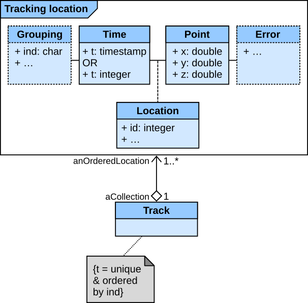

```{r setup, include=FALSE}
knitr::opts_chunk$set(
    echo = TRUE,
    fig.width = 6,
    fig.asp = 0.7
)

```

## Definitions of movement data

We start by defining the main objects that `sftrack` is dealing
with. At the top level, there is a **path**, i.e. the real-world
(continuous) curve made by moving objects (Fig. 1).

```{r, out.width = "75%", fig.align = "center", fig.cap = "Fig.1: Glossary introducing the main concepts.", echo = FALSE}


```

In practice, this curve is sampled (recorded) at discrete times to
collect **locations**, with or without temporal attributes (think of
non-invasive monitoring of animals such as snow tracks vs. direct
observations), i.e. in the form of $(x, y)$ or $(x, y, t)$
coordinates. Taken together, locations form the bulk of **occurrence
datasets**, such as the massive amount of biodiversity data found on
[Global Biodiversity Information Facility
(GBIF)](https://www.gbif.org/).

If the organism monitored is known and identified ($id$ attribute), we
can collect **tracking locations** (Fig. 1), i.e. $(x, y, t, id)$
coordinates. An ordered series of tracking locations together are in
turn the vertices of a **track**. A track is thus composed of a series
of locations, i.e. the "complete spatio-temporal record of a followed
organism, from the beginning to the end of observations"[^turchin].
Note that $id$ can be further refined as a general grouping factor
(e.g. collar, season, behavior, etc.), which basically split tracking
data into sub-tracks.

[^turchin]: Turchin, P. (1998). Quantitative analysis of movement: measuring and modeling population redistribution in animals and plants. Sinauer Associates, Sunderland, MA, USA.

Finally, tracking data can be modeled considering the temporal
autocorrelation between successive locations as part of the movement
information[^martin]. The most common approach for that purpose is
based on a model of **steps** (Fig. 1), defined as straight-line
segments between two successive tracking locations. Treating movement
steps as straight lines is of course an idealization, and the most
parsimonious approach (other complex approaches exist in some fields,
such as splines and Bezier curves), but at sufficient resolution, no
significant information is lost. A sequence of steps from the same
individual (not necessarily connected) finally forms a **trajectory**.

[^martin]: Martin, J., Tolon, V., Van Moorter, B., Basille, M., & Calenge, C. (2009). On the use of telemetry in habitat selection studies. In D. Barculo, & J. Daniels (Eds.), Telemetry: Research, Technology and Applications (pp. 37–55). Nova Science Publishers Inc.


### Tracking and movement data analyses

Because of the dual nature of tracking and movement data, each data
type allows different analyses based on the underlying geometric
representation (points vs. steps). The following table summarizes in
which case the use of tracking vs. movement data is appropriate:

| Data                     | Tracking data                | Movement data                                       |
|:-------------------------|:----------------------------:|:---------------------------------------------------:|
| Geometric representation | Points                       | Steps                                               |
| Applications             | Home ranges                  | Random walks                                        |
|                          | Resource selection functions | Step selection functions                            |
|                          | K-select                     | typical Hidden-Markov models and State-space models |
|                          |                              | typical segmentation methods                        |
|                          |                              | First passage time and Residence time               |
Table: Table 1: Overview of applications based on tracking and movement data.

While this is out of the scope of the `sftrack` package to provide
methods for these space use analyses, the package however provide the
underlying infrastructure for each case, and a few tools to handle
movement of both living organisms and inanimate objects.


## A conceptual model for movement

To organize these elements of data and how they relate to one another
and to properties of the real world entities (here a moving object),
we followed the methodology for conceptual modeling of geographic
information that is specified in the International Standards (ISO/TC
211), which relies on a standard conceptual model specified in Unified
Modeling Language (UML)[^roswell].

[^roswell]: Roswell, C. (2011). Modeling of geographic information. Springer Handbook of Geographic Information, 3–6. http://dx.doi.org/10.1007/978-3-540-72680-7_1


### Tracking locations

The basic element of the movement data is a **tracking location**. A
tracking location is, in its simplest form, a point defined by its
spatial coordinates $(x, y, z, t)$, with $z$ being optional,
associated to the corresponding timestamp $t$ (note that the time can
also be a simple integer defining the order, for instance in the case
of a track in the snow), and the identity of the moving object. This
is the raw data of movement, which is usually directly provided by a
tracking device.


Additionally, "grouping" information can be provided for the location:
this needs to be *a minima* the individual (`ind`), e.g. the actual
moving object (for instance an animal), but can also be extended to
other hierarchical level of the data, such as the year, the grouping, the
movement behavior, etc.

Spatial points are never exact and can be characterized by an
error. Typically, GPS and Argos data will provide information on the
quality of the location, such as satellite data or dilution of
precision (for GPS data). The challenge with this information on the
error is the complete lack of standardization — as such, this will be
left open for the time being.

Finally, a tracking location can also include any information at the
level of the point, such as environmental data measured at the
location (e.g. land cover).


### Tracking data

Tracking data, in the form of **tracks**, is a series of **tracking
locations**. This can be modeled as a collection of tracking
locations, unique and ordered in time by individual. As such,
locations are the vertices of a single track object; conversely, all
locations can be directly extracted from a single track (without any
loss of information).  The strong constraint on time is necessary and
sufficient to organize the data in a track.




### Steps

A **step** is specifically defined as the straight-line segment
connecting two successive **tracking locations**. In other words, it
takes two and only two locations to define a step, with the
constraints that they belong to the same grouping level (individual in
its simplest form), and that the second location comes temporally
after the first one.


Note that a step can also include information at the level of the line
segment. This can be for instance the amount of forest along the step,
or the movement rate (i.e. speed).


### Trajectories

Similarly to tracks, **trajectories** are defined by a series of
**steps**.  A trajectory is thus modeled as a collection of steps,
unique and ordered in time by individual. As such, steps are the
vertices of a single trajectory object; conversely, all steps can be
directly extracted from a single trajectory (without any loss of
information).  The strong constraint on time is necessary and
sufficient to organize the data in a trajectory.


Given the double equivalence between tracking locations and tracks, on
the one hand, and steps and trajectories, on the other hand, it
follows that there is also a direct equivalence between a track and a
trajectory (based on the same movement data); lossless conversion is
possible in both directions.


## Implementation in the `sftrack` package

The `sftrack` package deals with all elements presented above,
specifically **tracks** and **trajectories**. We'll begin with a brief
overview of an `sftrack` object. An `sftrack` object is a data object
that describes the movement of a subject, it has $(x,y)$ coordinates
(sometimes $z$), some measurement of time $t$ (clock time or a
sequence of integers), and some grouping variable that identifies the
subjects. For the spatial aspects of `sftrack`, we are using the
package `sf`, a powerful tool that lets us quickly calculate spatial
attributes and plot with ease with its full integration with `rgdal`.

An `sftrack` object has 4 parts to it, 3 of which are required:

 - **Geometry**: This is stored as an `sfc` object from `sf`. Accepts
   $(x,y,z)$ coordinates.
 - **Group**: This is the grouping variables, which contains at
   minimum an `id` field to identify the subject. Grouping variables
   can be turned on at various stages based on the 'active' grouping,
   allowing for the column to be more dynamic than a standard grouping
   column.
 - **Time**: Either a POSIX time object or an integer.
 - **Error**: (optional). This is the field with error data in it. At
   present the column name is being stored as an attribute, but it
   does not have any real functionality yet.

There are two different classes of objects: `sftrack` for **tracks**,
`sftraj` for **trajectories**.


### `sftrack` objects

An `sftrack` object stores tracking data (set of **tracks**) in a
`data.frame`, where the geometries are stored as a `POINT` for each
row.

```{r sftrack-overview, echo = FALSE}
library("sftrack")
data(raccoon)
raccoon$timestamp = as.POSIXct(raccoon$timestamp, tz = "EST5EDT")
my_sftrack <- as_sftrack(
  data = raccoon,
  coords = c("longitude","latitude"),
  time = "timestamp",
  group = "animal_id",
  crs = "+init=epsg:4326")
head(my_sftrack)
plot(my_sftrack)

```


### `sftraj` object

An `sftraj` object stores movement data (set of **trajectories**) in a
`data.frame`, where the geometries are stored as a `LINESTRING` for
each row. The linestring is a line built from the two points at 
$t_1 → t_2$. This means that when an `sftraj` object is modified the
steps likely need to be recalculated. Internally, anytime the active
group is changed, then the geometry is recalculated.

```{r sftraj-overview, echo = FALSE}
my_sftraj <- as_sftraj(my_sftrack)
head(my_sftraj)
plot(my_sftraj)

```
